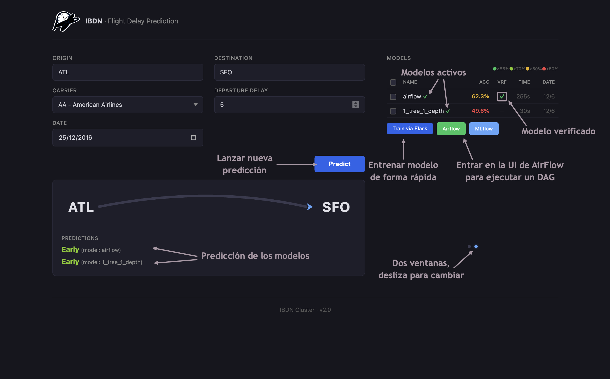
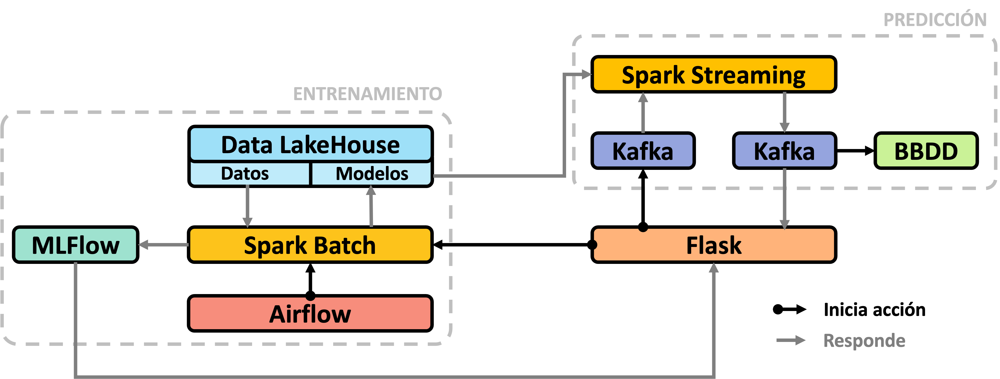

# Trabajo Big Data - IBDN
Este proyecto es el resultado del trabajo realizado para la asignatura IBDN (Ingeniería de Big Data en la Nube). El objetivo principal era desarrollar una aplicación de predicción de retrasos de vuelos utilizando diversas tecnologías y herramientas del ecosistema Big Data. Se puede encontrar el código original en: [https://github.com/Big-Data-ETSIT/practica_creativa](https://github.com/Big-Data-ETSIT/practica_creativa).


## Pasos para configurar el proyecto:

#### 1. Clonar repositorio:

```shell
git clone https://github.com/dbsada/Trabajo-BigData-IBDN.git
cd Trabajo-BigData-IBDN
```

#### 2. Configurar variables de entorno:
```shell
cp .env.example .env
```

#### 3. Instalar Docker y SBT:
Es necesario tener Docker y SBT instalados para ejecutar el proyecto. Se pueden instalar desde [aquí](https://www.docker.com/products/docker-desktop) (docker) y [aquí](https://www.scala-sbt.org/download/) (SBT) respectivamente. Nosotros los instalamos usando homebrew ([docker](https://formulae.brew.sh/formula/docker) y [sbt](https://formulae.brew.sh/formula/sbt)).

#### 4. Iniciar el proyecto:
```shell
python3 start.py
```

Puedes utilizar el comando `python3 start.py --skip-build` para saltar la fase de construcción de imágenes Docker y `python3 start.py --stop` para detener y eliminar los contenedores, redes y volúmenes asociados al proyecto.

## Iniciar la aplicación:
Navega a `http://localhost:5001` para acceder a la aplicación web de predicción de retrasos de vuelos. Desde allí, podrás interactuar con la aplicación y ver los resultados de las predicciones. A continuación se muestran algunas caputuras de la aplicación que muestran todas sus funcionalidades:



## Arquitectura:
La arqutitectura de la aplicación se compone de varios servicios que interactúan entre sí para proporcionar dos funcionalidades: entrenamiento de modelos y predicción de retrasos de vuelos:



> [!NOTE]
> Puedes ver todas los detalles de la arquitectura en [este documento](arquitectura.pdf).

## Autores:
- [Diego Besada](https://github.com/dbsada)
- [Natalia Corchón](https://github.com/nataliacorchon)