# Instrucciones para ejecutar con Docker

Se entiende que ya se han seguido los pasos de el [README](../README.md) para configurar el proyecto. Aquí se detallan los pasos específicos para ejecutar la aplicación usando Docker.

## Desplegar

Para desplegar la aplicación, puedes usar el comando `predict` con el argumento `docker` y elegir la base de datos que quieres usar (Cassandra o MongoDB):

```shell
predict docker --db cassandra   # POR DEFECTO
predict docker --db mongo
```

El comando mostrará por pantalla el progreso inicialización del entorno. Lo primero que se levantará será el contenedor de Flask. Se sugiere entrar en la url `http://localhost:5001`, donde se verá con mayor detalle el proceso de inicialización:

<div style="text-align: center; ">
    <a href="http://localhost:5001/" target="_blank"><em>http://localhost:5001/</em></a>
</div>

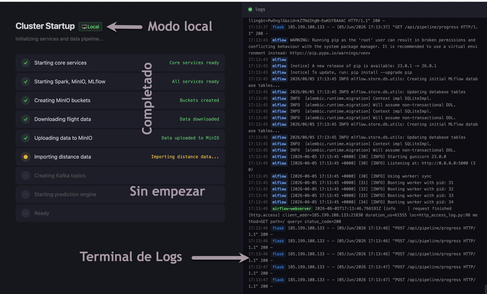

Una vez que el proceso de inicialización haya terminado, se accederá automaticamente a la aplicación principal:

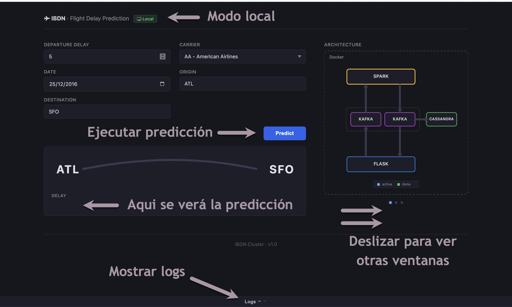

La interfaz principal muestra dos secciones diferenciadas:

- **Formulario de predicción** (izquierda): permite introducir los parámetros del vuelo y obtener una predicción pulsando el botón *Predict*. Si en este momento no puede pulsar el botón, no se preocupe, siga leyendo esta guía.

- **Ventana secundaria** (derecha): Tiene 3 vistas diferentes. Por defecto, muestra un esquema de la arquitectura, deslizando horizontalmente sobre ella se puede acceder a la vista de modelos y a la vista de servicios.

Además, en la parte inferior, podrá ver una pestaña que abre una terminal con los logs de la aplicación.

## Entrenar un modelo
Si hasta ahora no ha podido pulsar el botón *Predict*, es porque no hay ningún modelo disponible. Acceda a la vista de modelos deslizando horizontalmente sobre la ventana secundaria y pulse el botón *Train* para entrenar un modelo:

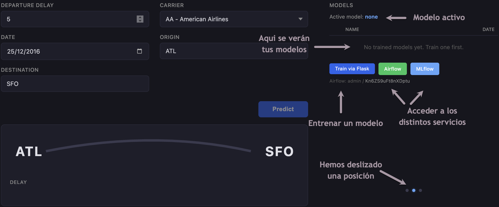

Puedes modificar los hiperparámetros del modelo antes de entrenar:

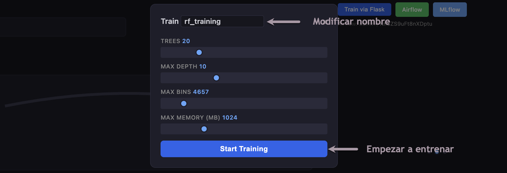

Si lo que quieres es entrenar un modelo lo más rápido posible, configura `TREES=1` y `MAX DEPTH=1`. Una vez pulsado el botón *Train*, se mostrará cómo el modelo está entrenando:

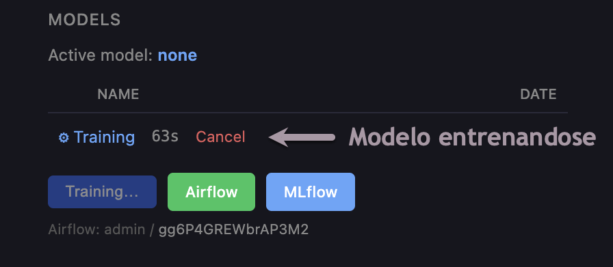

> [!WARNING]
> Es posible que el proceso de entrenamiento no se muestre automáticamente en la interfaz. Es un bug que no se ha podido solucionar. Espera unos segundos y recarga la página. No trates de entrenar un nuevo modelo mientras el anterior se está entrenando.

Para activar el modelo, haz click encima de él y después pulsa el botón *Activate*:

<table>
  <tr>
    <td align="center">
      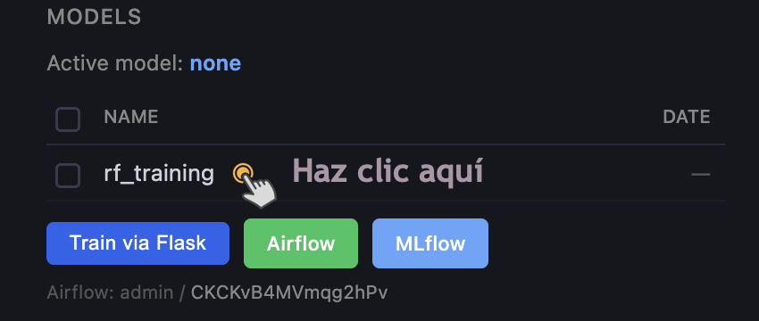<br>
      <sub>Step 1</sub>
    </td>
    <td align="center">
      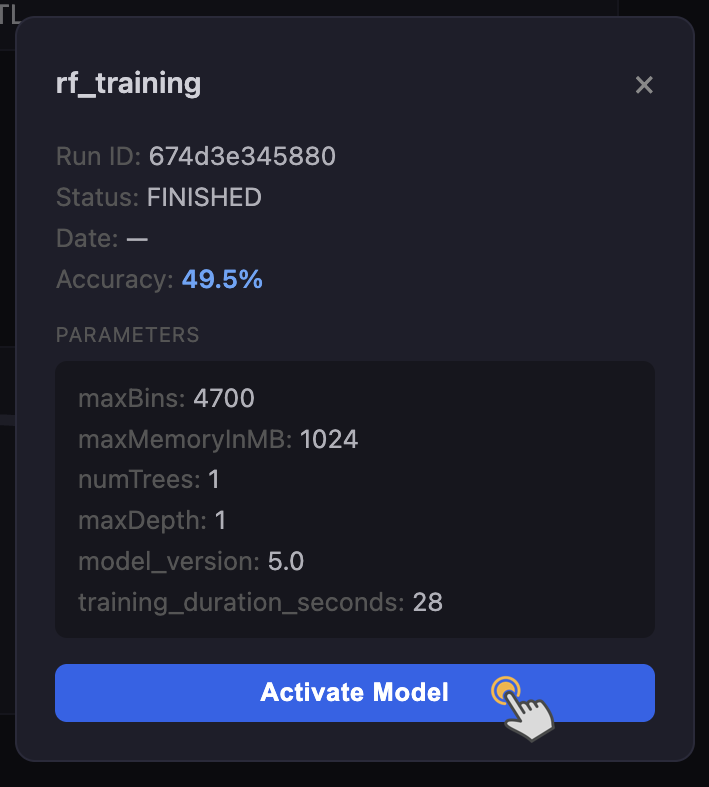<br>
      <sub>Step 2</sub>
    </td>
    <td align="center">
      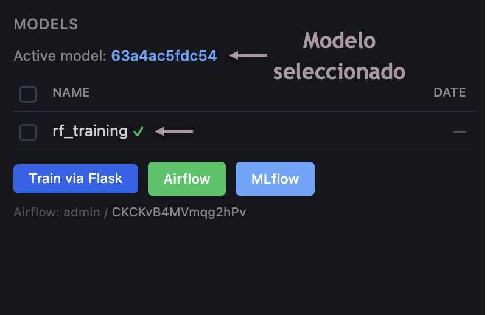<br>
      <sub>Step 3</sub>
    </td>
  </tr>
</table>

Ahora puedes ejecutar una predicción. Se sugiere volver a la página de la arquitectura para ver como se van iluminando los diferentes servicios a medida que se ejecuta la predicción:

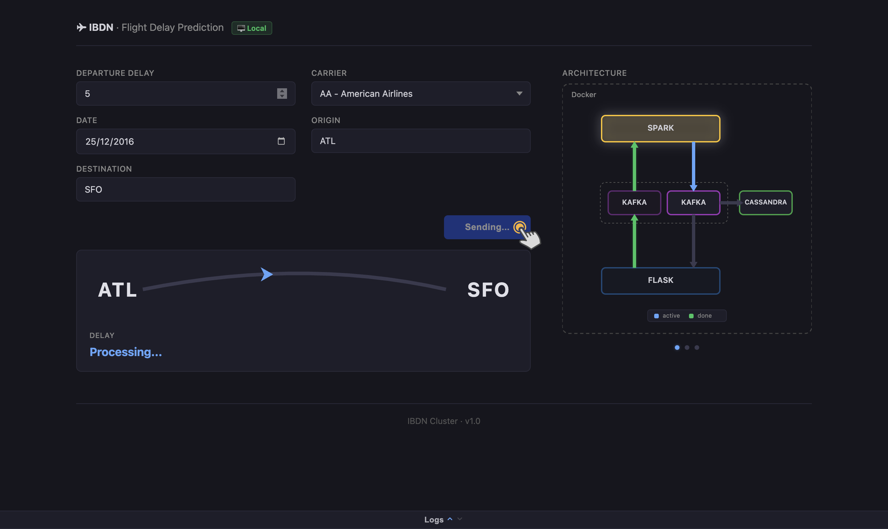

> [!NOTE] 
> No se preocupe si la animación termina y no ha obtenido la predicción. La animación es únicamente una simulación visual del proceso de predicción, la predicción puede tardar unos segundos más.

## Entrenar un modelo con Airflow
Uno de los requisitos de la práctica era incorporar un sistema de orquestación. Realmente, el programa de python ya había sido diseñado para orquestar todo el proceso y este no era necesario para una aplicación tan sencilla. Sin embargo, se ha incorporado Airflow para demostrar su funcionamiento. 

Para entrenar un modelo con Airflow, acceda a la vista de modelos y pulse el botón Airflow. Le pedirá que introduzca usuario y contraseña, puede obtenerlas de la propia vista de modelos:

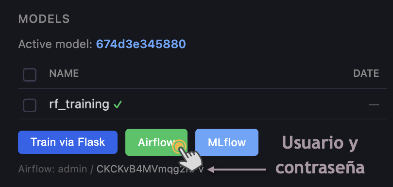

>[!NOTE]
> La contraseña es un UUID aleatorio, no será la misma que la mostrada en la imagen.

Una vez introducidas las credenciales, se abrirá la interfaz de Airflow. En ella, deberá acceder al panel de DAGs:

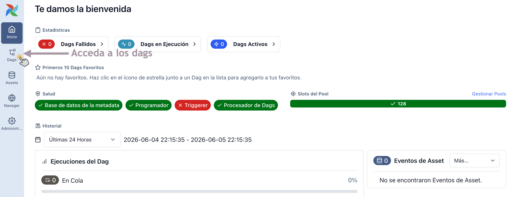

Encontrarás un único DAG, asegúrate de que esté activado y haz click en el nombre del DAG para acceder a su vista:

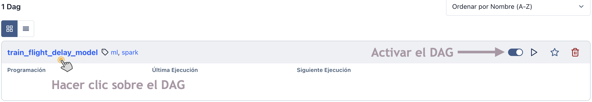

En esta vista, haz click en el botón *Trigger DAG* para ejecutar el DAG:

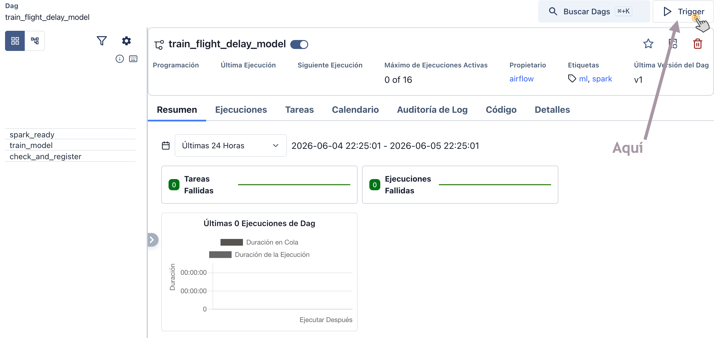

Una vez ejecutado el DAG, verás que todas las tareas se ejecutan.

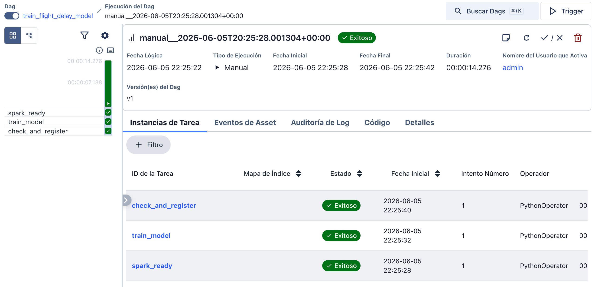

Verás este modelo entrenándose también en la vista de modelos de la aplicación.

## Las otras vistas:
La vista de servicios muestra rápidamente el estado de cada servicio:

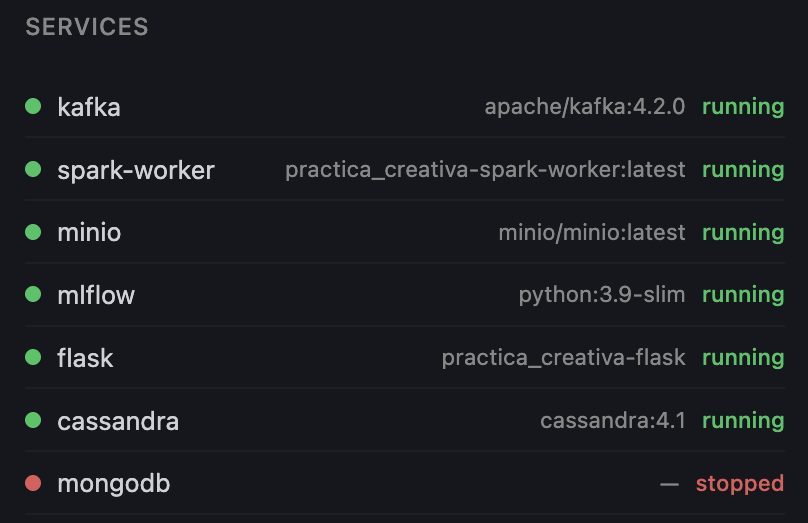

En este caso, vemos como todos los servicios están activos, excepto mongodb, puesto que se está usando Cassandra como base de datos.

La otra vista es la terminal de logs, donde se muestran los logs de la aplicación. Es especialmente útil para ver el proceso de inicialización y detectar posibles errores:

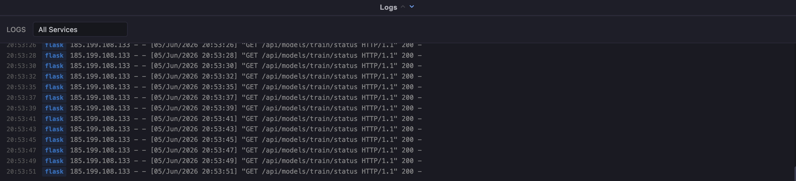

En este caso vemos como la aplicación revisa de manera continua (cada 2 segundos) si el modelo en entrenamiento ha terminado.