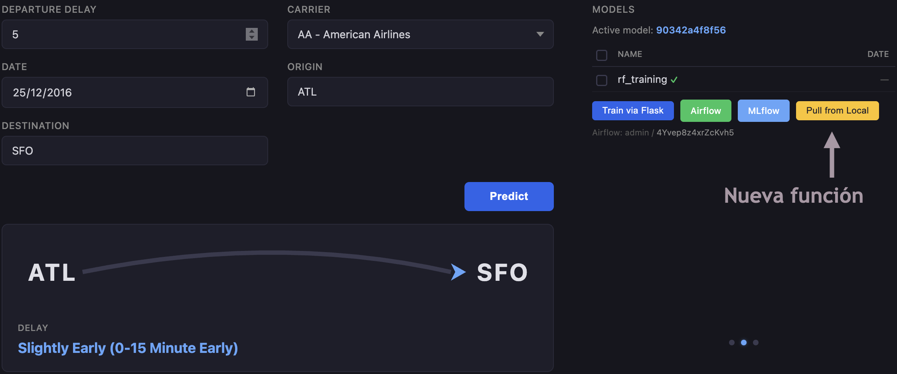

# Instrucciones para ejecutar con Google Kubernetes Engine (GKE)

Se entiende que ya se han seguido los pasos de el [README](../README.md) para configurar el proyecto. Aquí se detallan los pasos específicos para ejecutar la aplicación usando Google Kubernetes Engine.

En realidad el proceso es muy similar al de Docker, por lo que se solicita al lector que revise esa sección y posteriormente revise esta guía, que contendrá exclusivamente las diferencias con el proceso de Docker.

## Desplegar

Para desplegar la aplicación, puedes usar el comando `predict` con el argumento `gke`:

```shell
predict gke
```

## Diferencias en la interfaz
En la vista de modelos de Google Cloud, se puede ver un nuevo botón:



Este botón permite transferir los modelos entrenados desde tu máquina local hasta Google Cloud. Es especialmente útil si vienes de ejecutar esa sección y quieres aprovechar los modelos o ahorrar tiempo de entrenamiento.

Además, la sección de servicios ha sido reemplazada por una sección dónde se pueden ver los pods que se están ejecutando en el cluster de Kubernetes distribuidos en los diferentes nodos:

